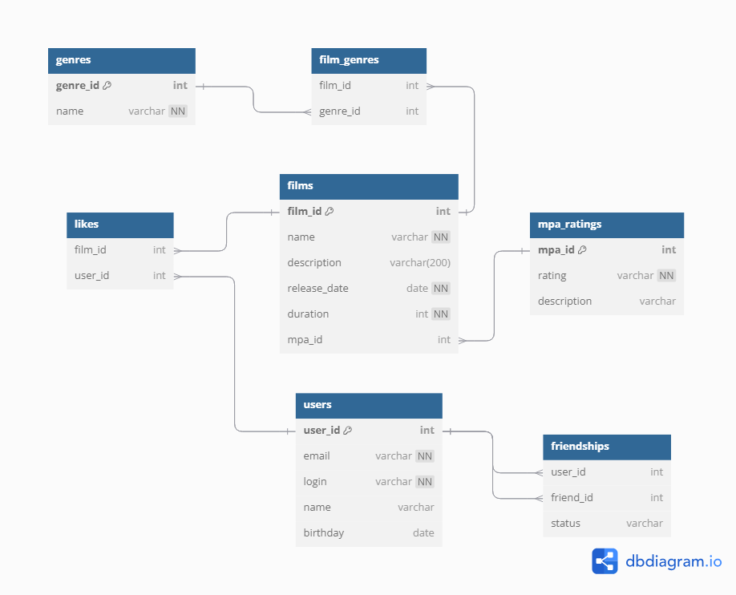

# java-filmorate
Template repository for Filmorate project.


## Пример запросов

### 1. Получение всех фильмов
```sql
SELECT *
FROM films;
```

### 2. Добавление нового фильма
```sql
INSERT INTO films (name, description, release_date, duration, mpa_id)
VALUES ('Film Name', 'Film Description', '2023-01-01', 120, 1);
```

### 3. Добавление нового пользователя
```sql
INSERT INTO users (email, login, name, birthday)
VALUES ('email@example.com', 'username', 'User Name', '1990-01-01');
```